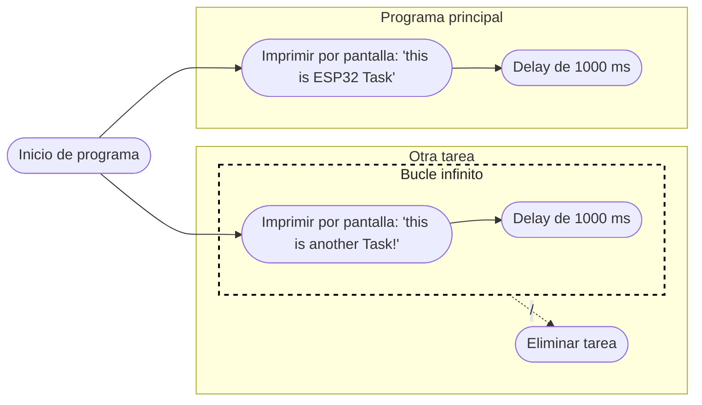

# Práctica 3. Gerard Cots y Joel J. Morera

## Introducción teórica

Pongamos por caso que tenemos un microcontrolador que lee un sensor de temperatura, lo muestra por una pantalla de tinta electrónica y lo envía a la nube. 

En caso que la pantalla de tinta electrónica tarde unos segundos en actualizarse, nos encontramos con que el resto de procesos venideros se ejecutan más tarde
debido a la demora de la pantalla. 

Si destinasemos un núcleo a imprimir el valor por pantalla y el resto se encargasen de los demás procesos no evitariamos la 
posible demora.

## Ejercicio práctico 1 

El funcionamento de este programa consiste en

EL **código** es el siguiente:

```cpp
#include <Arduino.h>

void setup()
{
    Serial.begin(112500);
    /* we create a new task here */
    xTaskCreate(
    anotherTask, /* Task function. */
    "another Task", /* name of task. */
    10000, /* Stack size of task */
    NULL, /* parameter of the task */
    1, /* priority of the task */
    NULL); /* Task handle to keep track of created task */
}

/* the forever loop() function is invoked by Arduino ESP32 loopTask */
void loop()
{
    Serial.println("this is ESP32 Task");
    delay(1000);
}

/* this function will be invoked when additionalTask was created */
void anotherTask( void * parameter )
{
    /* loop forever */
    for(;;)
    {
        Serial.println("this is another Task");
        delay(1000);
    }
    /* delete a task when finish,
    this will never happen because this is infinity loop */
    vTaskDelete( NULL );
}
```

El **diagrama de flujo** es:



## Ejercicio práctico 2

La función principal de este programa consiste en definir dos tareas, una que enciende un led y otra que lo apaga, ambas sincronizadas.

EL **código** es el siguiente:

```cpp

```

El **diagrama de flujo** es:
## Ejercicio práctico complementario

El siguiente programa realiza efectos visuales con 4 LEDS.

El **código** es el siguiente:
```cpp

```

El **diagrama de flujo** es: