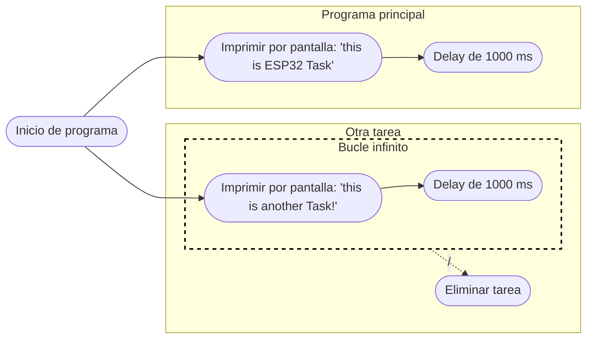
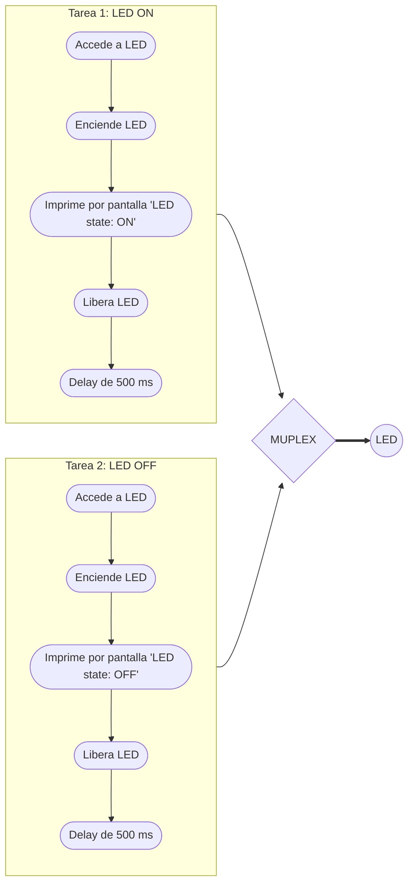
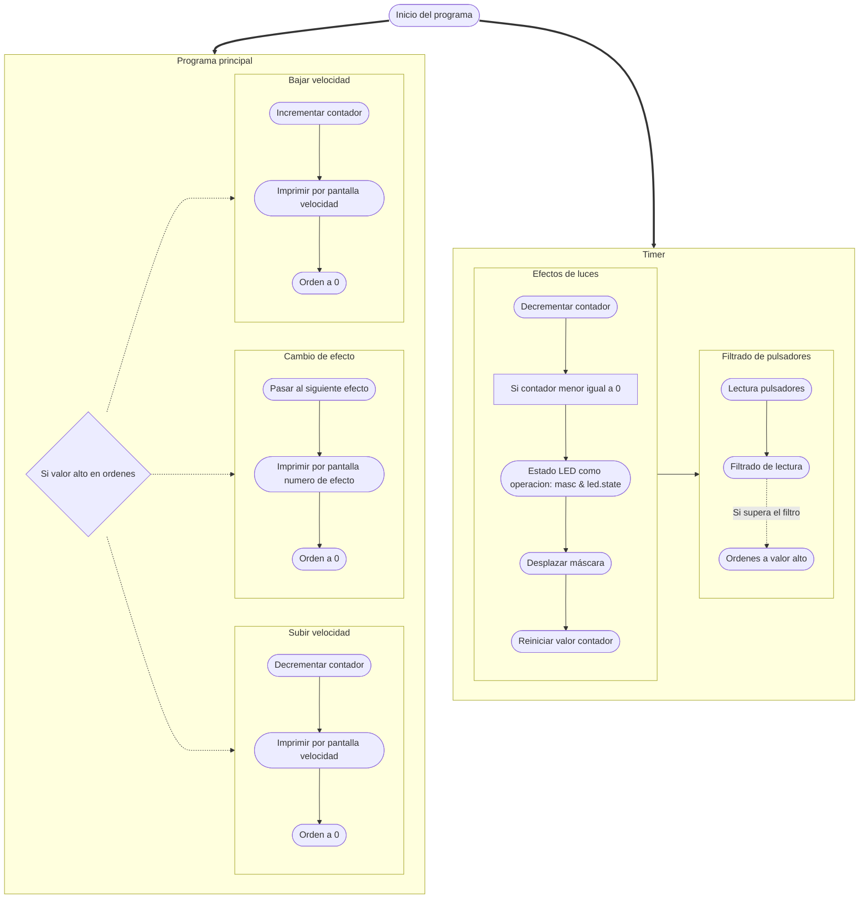

# Práctica 3. Gerard Cots y Joel J. Morera

## Introducción teórica

Pongamos por caso que tenemos un microcontrolador que lee un sensor de temperatura, lo muestra por una pantalla de tinta electrónica y lo envía a la nube. 

En caso que la pantalla de tinta electrónica tarde unos segundos en actualizarse, nos encontramos con que el resto de procesos venideros se ejecutan más tarde
debido a la demora de la pantalla. 

Si destinasemos un núcleo a imprimir el valor por pantalla y el resto se encargasen de los demás procesos no evitariamos la 
posible demora.

## Ejercicio práctico 1 

El funcionamento de este programa consiste en la ejecución de dos tareas que imprimen por pantalla un mensaje. 

Por una parte, se ejecuta el codigo principal `loop` que imprime por pantalla 'this is ESP32 Task'.

A su vez, se ejecuta la tarea `anotherTask` que imprime por pantalla 'this is another Task'.

Ambas tareas se ejecutan a la vez, como ya hemos comentado, por lo que en el puerto serie aparecen ambos mensajes simultaneamente:

```bash
this is ESP32 Task
this is another Task
this is ESP32 Task
this is another Task
this is ESP32 Task
this is another Task
...
```

El **código** es el siguiente:

```cpp
#include <Arduino.h>

/* this function will be invoked when additionalTask was created */
void anotherTask( void * parameter )
{
    /* loop forever */
    for(;;)
    {
        Serial.println("this is another Task");
        delay(1000);
    }
    /* delete a task when finish,
    this will never happen because this is infinity loop */
    vTaskDelete( NULL );
}
void setup()
{
    Serial.begin(112500);
    /* we create a new task here */
    xTaskCreate(
    anotherTask, /* Task function. */
    "another Task", /* name of task. */
    10000, /* Stack size of task */
    NULL, /* parameter of the task */
    1, /* priority of the task */
    NULL); /* Task handle to keep track of created task */
}

/* the forever loop() function is invoked by Arduino ESP32 loopTask */
void loop()
{
    Serial.println("this is ESP32 Task");
    delay(1000);
}
```

El **diagrama de flujo** es:



## Ejercicio práctico 2

La función principal de este programa consiste en definir dos tareas, una que enciende un led y otra que lo apaga, ambas sincronizadas.

Con tal de que ambas tareas esten sincronizadas se hace uso de semaforos, en concreto de 'mutex'. Este tipo de semaforos permiten el acceso a un mismo recurso de manera segura, sin que se corrompa información, al querer acceder ambas tareas simultaneamente.

De manera resumida mientras una tarea este accediendo al recurso se manda una señal de espera a la otra tarea, denegando el acceso. Cuando la primera tarea termine se libera el recurso y permite a la otra tarea acceder a él. 

Por ulimo, cabe comentar que, además, se ha añadido un 'delay' de 2000 ms entre encendido y apagado.

El **código** es el siguiente:

```cpp
#include <Arduino.h>

//Creation of semaphore
SemaphoreHandle_t mutex;

//Other variables
int LED = 23;

//Code from the task that sets the LED on.
void TaskSetLedON (void *pvParameters)
{
	for(;;)
	{	
		xSemaphoreTake(mutex, portMAX_DELAY);
		digitalWrite(LED, HIGH);
		Serial.println("LED state: ON");	
		xSemaphoreGive(mutex);
		vTaskDelay(pdMS_TO_TICKS(2000));
	}
}

//Code from the task that sets the LED off.
void TaskSetLedOFF (void *pvParameters)
{
	for(;;)
	{		
		xSemaphoreTake(mutex, portMAX_DELAY);	
		digitalWrite(LED, LOW);
		Serial.println("LED state: OFF");
		xSemaphoreGive(mutex);	
		vTaskDelay(pdMS_TO_TICKS(2000));
	}
}

//Codigo que solo se ejecuta una vez
void setup()
{
	// Transmision rate
	Serial.begin(115200);

	//Set LED pin as OUTPUT
	pinMode(LED,OUTPUT);
	
	// Tasks creation
	xTaskCreate(TaskSetLedON, "LED_ON", 10000, NULL, 0, NULL);
	xTaskCreate(TaskSetLedOFF, "LED_OFF", 10000, NULL, 0, NULL);
	
	//Semaphore creation
	mutex = xSemaphoreCreateMutex();
	if(mutex == NULL)Serial.println("ERROR: Mutex cannot be created");
}

//Codigo que se ejeucta multiples veces
void loop() {}

```

El **diagrama de flujo** es:



La salida que se obtiene por el puerto serie:
```bash
LED state: ON
LED state: OFF
LED state: ON
LED state: OFF
LED state: ON
LED state: OFF
...
```
## Ejercicio práctico complementario

El siguiente programa realiza efectos visuales con 8 LEDS. Para ello contamos con 3 pulsadores, 2 de ellos sirven para controlar la velocidad de repetición de cada iteración y el otro para cambiar el efecto de los LEDs.

La gestión de los pulsadores y el efecto de los LEDs se controla mediante un 'timer', en el que la lectura de los pulsadores es filtrada en tiempo real de rebotes.

El efecto de los LEDs se realiza mediante una máscara, un byte que contiene una sola posicion a valor alto y se multiplica con el estado de cada LED, desplazando una posición los bits de la máscara conseguimos que solo se activen los bits que coincidan en cada posición. Cada uno de los modos de luces esta guardado dentro de una classe(`modes_t`), que especifica como es el estado de cada LED en un byte.

Por otra parte, se realiza el procesado de ordenes dentro del bucle principal. Cuando la variable `orden` de la estructura `Button` esta a valor alto en alguno de los pulsadores acitva las ordenes correspondientes de cada pulsador.

En caso que se quiera bajar la velocidad se aumenta la variable contador, que aparece como `cont` y como `conti`, siendo este su valor inicial. Decrementar la variable sera, por lo tanto, aumentar la velocidad. Por lo que el contador es el retraso que hay entre cada iteración en el efecto de los LEDs.

Por último, el control de efectos se realiza alternando entre los valores posibles de `effectOrder`, esta variable sirve como indice para la funcion `maskType`, donde aparecen para cada uno de los posibles efectos el modo que les pertoca. Siendo los modos estos:

| LED | Modo 1 | Modo 2 | Modo 3 | Modo 4 | Modo 5 | Modo 6 | Modo 7 |
| :---: | :---:  | :---:  | :---:  | :---:  | :---:  | :---:  | :---:  |
| LED 1 | 0b00000001  |  0b10000000  |  0b01000001  |  0b01010101  |  0b00010001  |  0b10001000  |  0b00010001 |
| LED 2 | 0b00000010  |  0b01000000  |  0b10000010  |  0b10101010  |  0b00100010  |  0b01000100  |  0b00110011 |
| LED 3 | 0b00000100  |  0b00100000  |  0b00000101  |  0b01010101  |  0b01000100  |  0b00100010  |  0b01110111 |
| LED 4 | 0b00001000  |  0b00010000  |  0b00001010  |  0b10101010  |  0b10001000  |  0b00010001  |  0b11111111 |
| LED 5 | 0b00010000  |  0b00001000  |  0b00010100  |  0b01010101  |  0b10001000  |  0b00010001  |  0b11111111 |
| LED 6 | 0b00100000  |  0b00000100  |  0b00101000  |  0b10101010  |  0b01000100  |  0b00100010  |  0b01110111 |
| LED 7 | 0b01000000  |  0b00000010  |  0b01010000  |  0b01010101  |  0b00100010  |  0b01000100  |  0b00110011 |
| LED 8 | 0b10000000  |  0b00000001  |  0b10100000  |  0b10101010  |  0b00010001  |  0b10001000  |  0b00010001 |

De los requesitos operativos del programa los que se cumplen son:

- [x] El programa de gestion de lectura y efectos se basa en una interrupción del timer.
- [x] La gestion de pulsadores dispone de un filtrado en tiempo real de rebotes y lanza las ordenes de ejecucion en los flancos de bajada. Estas ordenes se ejecutan por el programa de procesado de ordenes.
- [ ] El programa se separara en 2 zonas, una de lectura de pulsadores y de gestion de efectos de leds, esta se realiza en un core; y otra en que se realiza el procesado de las ordenes, en un segundo core.
- [x] Los efectos luminosos de los leds se deben guardar en una estructura donde se pueda indicar las diferentes activaciones relativas entre cada led.
- [ ] Las modificaciones entre animaciones se realizaran recorriendo una tabla de punteros a estructuras.

> **Nota:** Se pueden encontrar videos del funcionamento en hardware del programa en la carpeta `/images`.

El **código** es el siguiente:

```cpp
#include <Arduino.h>
#include<vector>

//Definición de objetos
class Button                                                  //Definición del objeto boton
{
  public:
    uint8_t pin;                                              //Pin del boton
    bool val_act, val_ant, cambioact, cambioanterior, orden;  //Variables de filtro
    
    //API
    Button(uint8_t PPIN)                                      //Constructor por PIN
    {
      pin = PPIN;
      val_ant = 1;
      orden = 0;
    }
};

class LED                                                     //Definición del objeto LED 
{
  public:
    uint8_t pin;                                              //Pin del LED
    byte state;                                               //Estado del LED

    //API
    LED(){}                                                   //Constructor por defecto del LED
    LED(uint8_t pin, byte state): pin(pin), state(state){}    //Constructor por parametros del LED

    LED& operator =(const LED& L)                             //Operador de asignación del LED
    {
      if (this != &L)
      {
        this -> state = L.state;
        this -> pin = L.pin ;
      }
      return(*this);
    } 
};

class modes_t                                                  //Definición del objeto Modos
{
  public:
    LED led_1,                                                 //Variables LED
        led_2,
        led_3,
        led_4,
        led_5,
        led_6,
        led_7,
        led_8;
    //API
    modes_t(){}                                                 //Constructor por defecto de los modos
    modes_t(byte state1, byte state2, byte state3, byte state4, 
            byte state5, byte state6, byte state7, byte state8) //Constructor por parametros de los modos
    {
      led_1.pin = 12; led_1.state = state1;
      led_2.pin = 13; led_2.state = state2;
      led_3.pin = 14; led_3.state = state3;
      led_4.pin = 27; led_4.state = state4;
      led_5.pin = 16; led_5.state = state5;
      led_6.pin = 17; led_6.state = state6;
      led_7.pin = 18; led_7.state = state7;
      led_8.pin = 19; led_8.state = state8;
    }
    modes_t& operator =(const modes_t& A)                       //Operador de asignacion de los modos
    {
      if(this != &A)
      {
        this -> led_1 = A.led_1;
        this -> led_2 = A.led_2;
        this -> led_3 = A.led_3;
        this -> led_4 = A.led_4;
        this -> led_5 = A.led_5;
        this -> led_6 = A.led_6;
        this -> led_7 = A.led_7;
        this -> led_8 = A.led_8;
      }
      return(*this);
    }
};

//Definición de botones
Button  button_speed_up(25),
        button_speed_down(32),
        button_effect(33);

//Definición de modos
modes_t mode_1(
              0b00000001,
              0b00000010,
              0b00000100,
              0b00001000,
              0b00010000,
              0b00100000,
              0b01000000,
              0b10000000
      ),
      mode_2(
              0b10000000,
              0b01000000,
              0b00100000,
              0b00010000,
              0b00001000,
              0b00000100,
              0b00000010,
              0b00000001
      ),
      mode_3(
              0b01000001,
              0b10000010,
              0b00000101,
              0b00001010,
              0b00010100,
              0b00101000,
              0b01010000,
              0b10100000
      ),
      mode_4(
              0b01010101,
              0b10101010,
              0b01010101,
              0b10101010,
              0b01010101,
              0b10101010,
              0b01010101,
              0b10101010
      ),
      mode_5(
              0b00010001,
              0b00100010,
              0b01000100,
              0b10001000,
              0b10001000,
              0b01000100,
              0b00100010,
              0b00010001
      ),
      mode_6(
              0b10001000,
              0b01000100,
              0b00100010,
              0b00010001,
              0b00010001,
              0b00100010,
              0b01000100,
              0b10001000
      ),
      mode_7(
              0b00010001,
              0b00110011,
              0b01110111,
              0b11111111,
              0b11111111,
              0b01110111,
              0b00110011,
              0b00010001
      );
modes_t mode_v = mode_1;                    //Variable modo
                               
//Global variables
hw_timer_t * timer = NULL;                  //Puntero a timer
int conti = 15, cont = 15;                  //Variables contadoras
int effectOrder = 1;                        //Variable para el numero de efecto
byte  masc = 0b00000001,                    //Definición máscara
      masc_ini = masc;                      //Valor inicial de máscara 

//Declaración de funciones
void mascType();
void IRAM_ATTR buttonManagement();       
void lightsEffects();

//Código que solo se efecuta una vez
void setup()
{
  //Velocidad de transmisión
  Serial.begin(115200);

  //Definición de pines de los LEDs
  pinMode(mode_v.led_1.pin, OUTPUT);
  pinMode(mode_v.led_2.pin, OUTPUT);
  pinMode(mode_v.led_3.pin, OUTPUT);
  pinMode(mode_v.led_4.pin, OUTPUT);
  pinMode(mode_v.led_5.pin, OUTPUT);
  pinMode(mode_v.led_6.pin, OUTPUT);
  pinMode(mode_v.led_7.pin, OUTPUT);
  pinMode(mode_v.led_8.pin, OUTPUT);
  
  //Definición de los pines de los pulsadores
  pinMode(button_effect.pin,INPUT_PULLUP);
  pinMode(button_speed_down.pin,INPUT_PULLUP);
  pinMode(button_speed_up.pin,INPUT_PULLUP);

  //Definición del timer
  timer = timerBegin(0, 80, true);                            //Inicialización del timer
  timerAttachInterrupt(timer, &buttonManagement, true);       //Relacionar la funcion que se ejecuta con el timer
  timerAlarmWrite(timer, 50000, true);                        //Especificar tiempo entre interrupciones
  timerAlarmEnable(timer);                                    //Activar el timer

}

//Código que se ejecuta repetitivamente
void loop() 
{
  if (button_effect.orden)                                    //Si orden a valor alto de siguiente efecto
  {
    effectOrder++;                                            //Siguiente efecto
    if (effectOrder > 7) effectOrder = 1;                     //En caso de ser el ultimo volvemos al del inicio
    mascType();                                               //Llamada a 'maskType()'
    Serial.print("Cambio estado a: ");                        //Imprimimos el numero de efecto
    Serial.println(effectOrder);
    button_effect.orden = 0;                                  //Orden del boton a 0
  }

  if (button_speed_up.orden)                                  //Si orden aumentar velocidad
  {
    conti -= 1;                                               //Decrementamos el contador
    if(conti == 0)conti = 1;                                  //Contador debe ser mayor o igual a 1
    Serial.print("Contador desciende a: ");                   //Imprimimos el valor del contador
    Serial.println(conti);                                   
    button_speed_up.orden = 0;                                //Orden del boton a 0
  } 

  if (button_speed_down.orden)                                //Si orden decrementar velocidad       
  {                        
    conti += 1;                                               //Aumentamos el contador
    Serial.print("Contador asciende a: ");                    //Imprimimos el valor del contador
    Serial.println(conti);                     
    button_speed_down.orden = 0;                              //Orden del boton a 0
  } 

  delay(500);
}

//Efectos de luces
void lightsEffects()
{
  if(cont-- <= 0)                                               //Si el contador llega a 0 se ejecuta el código
  {
    if(masc == 0)masc = masc_ini;                               //Si la máscara llega a 0 se reinicia

    digitalWrite(mode_v.led_1.pin, masc & mode_v.led_1.state);  //El valor de los LEDs se definie como la operacion 'AND' entre su estado y la máscara
    digitalWrite(mode_v.led_2.pin, masc & mode_v.led_2.state);
    digitalWrite(mode_v.led_3.pin, masc & mode_v.led_3.state);
    digitalWrite(mode_v.led_4.pin, masc & mode_v.led_4.state);
    digitalWrite(mode_v.led_5.pin, masc & mode_v.led_5.state);
    digitalWrite(mode_v.led_6.pin, masc & mode_v.led_6.state);
    digitalWrite(mode_v.led_7.pin, masc & mode_v.led_7.state);
    digitalWrite(mode_v.led_8.pin, masc & mode_v.led_8.state);

    masc *= 2;                                                  //Movemos los valores de la máscara una posición
    cont = conti;                                               //Reiniciamos el contador
  } 
}

//Effects management
void mascType()
{
  switch(effectOrder)
  {
    case 1:             //Si la variable 'effectOrder' es igual a 1, se selecciona el modo 1
      mode_v = mode_1;
      break;
    case 2:             //Si la variable 'effectOrder' es igual a 2, se selecciona el modo 2
      mode_v = mode_2;
      break;
    case 3:             //Si la variable 'effectOrder' es igual a 3, se selecciona el modo 3
      mode_v = mode_3;
      break;
    case 4:             //Si la variable 'effectOrder' es igual a 4, se selecciona el modo 4
      mode_v = mode_4;
      break;
    case 5:             //Si la variable 'effectOrder' es igual a 5, se selecciona el modo 5
      mode_v = mode_5;
      break;
    case 6:             //Si la variable 'effectOrder' es igual a 6, se selecciona el modo 6
      mode_v = mode_6;
      break;
    case 7:             //Si la variable 'effectOrder' es igual a 7, se selecciona el modo 7
      mode_v = mode_7;
      break;
  }
}

//Función timer para la lectura de pulsadores y los efectos de los LEDs
void IRAM_ATTR buttonManagement()
{
  lightsEffects();                                                                      //Efectos de luces
  
  //Leemos el valor de los pulsadores
  button_speed_up.val_act = digitalRead(button_speed_up.pin); 
	button_speed_down.val_act = digitalRead(button_speed_down.pin);
	button_effect.val_act = digitalRead(button_effect.pin); 

  //Cambio actual como la operación XOR entre el valor actual y el valor antiguo
	button_speed_up.cambioact = button_speed_up.val_ant ^ button_speed_up.val_act;    
	button_speed_down.cambioact = button_speed_down.val_ant ^ button_speed_down.val_act;    
	button_effect.cambioact = button_effect.val_ant ^ button_effect.val_act;     

  //Si los dos cambios son igual a 1, entonces:
  if (button_speed_up.cambioact == 1 && button_speed_up.cambioanterior == 1)  
  {
    button_speed_up.orden = 1;                                                //Orden a valor alto
    
    button_speed_up.val_ant = button_speed_up.val_act;                        //Valor antiguo igual a valor actual
    button_speed_up.cambioanterior = 0;                                       //Cambio anterior igual a 0
    return;                                         
  }

  if (button_speed_down.cambioact == 1 && button_speed_down.cambioanterior == 1)  
  {
    button_speed_down.orden = 1;                                              //Orden a valor alto
                   
    button_speed_down.val_ant = button_speed_down.val_act;                    //Valor antiguo igual a valor actual
    button_speed_down.cambioanterior = 0;                                     //Cambio anterior igual a 0
    return;                                         
  }

  if (button_effect.cambioact == 1 && button_effect.cambioanterior == 1)  
  {
    button_effect.orden = 1;                                                //Orden a valor alto        
                                                          
    button_effect.val_ant = button_effect.val_act;                          //Valor antiguo igual a valor actual
    button_effect.cambioanterior = 0;                                       //Cambio anterior igual a 0
    return;                                         
  }
  
  //Cambio anterior es igual a cambio actual
  button_speed_up.cambioanterior = button_speed_up.cambioact;  
  button_speed_down.cambioanterior = button_speed_down.cambioact;
	button_effect.cambioanterior = button_effect.cambioact;
}
```

El **diagrama de flujo** es:


