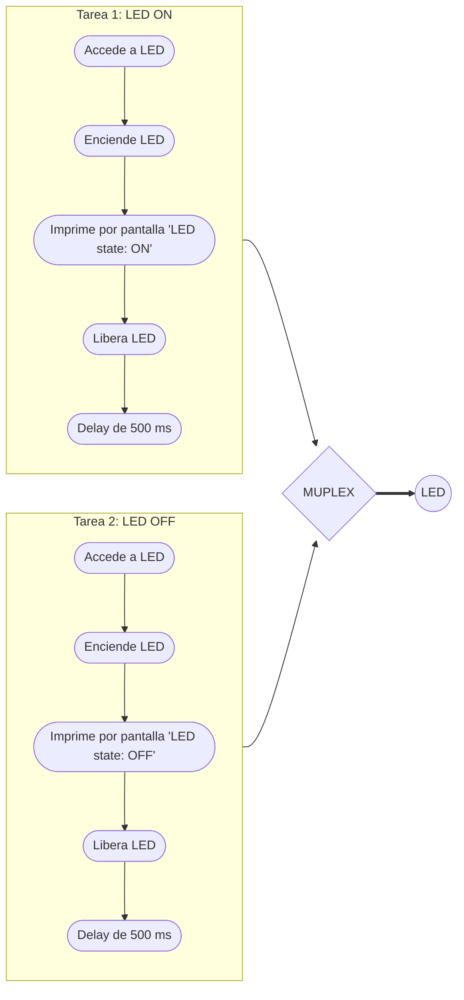
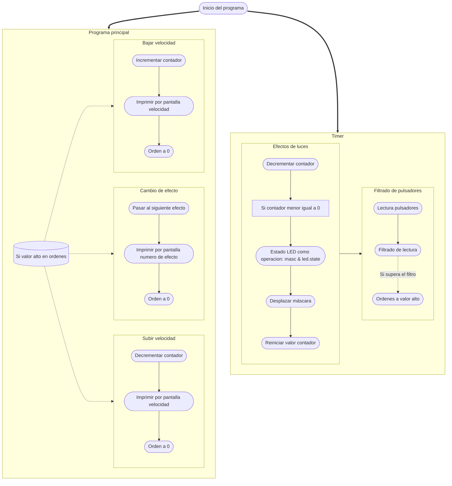

# Práctica 3. Gerard Cots y Joel J. Morera

## Introducción teórica

Pongamos por caso que tenemos un microcontrolador que lee un sensor de temperatura, lo muestra por una pantalla de tinta electrónica y lo envía a la nube. 

En caso que la pantalla de tinta electrónica tarde unos segundos en actualizarse, nos encontramos con que el resto de procesos venideros se ejecutan más tarde
debido a la demora de la pantalla. 

Si destinasemos un núcleo a imprimir el valor por pantalla y el resto se encargasen de los demás procesos no evitariamos la 
posible demora.

## Ejercicio práctico 1 

El funcionamento de este programa consiste en la ejecución de dos tareas que imprimen por pantalla un mensaje. 

Por una parte, se ejecuta el codigo principal `loop` que imprime por pantalla 'this is ESP32 Task'.

A su vez, se ejecuta la tarea `anotherTask` que imprime por pantalla 'this is another Task'.

Ambas tareas se ejecutan a la vez, como ya hemos comentado, por lo que en el puerto serie aparecen ambos mensajes simultaneamente:

```bash
this is ESP32 Task
this is another Task
this is ESP32 Task
this is another Task
this is ESP32 Task
this is another Task
...
```

El **código** es el siguiente:

```cpp
#include <Arduino.h>

/* this function will be invoked when additionalTask was created */
void anotherTask( void * parameter )
{
    /* loop forever */
    for(;;)
    {
        Serial.println("this is another Task");
        delay(1000);
    }
    /* delete a task when finish,
    this will never happen because this is infinity loop */
    vTaskDelete( NULL );
}
void setup()
{
    Serial.begin(112500);
    /* we create a new task here */
    xTaskCreate(
    anotherTask, /* Task function. */
    "another Task", /* name of task. */
    10000, /* Stack size of task */
    NULL, /* parameter of the task */
    1, /* priority of the task */
    NULL); /* Task handle to keep track of created task */
}

/* the forever loop() function is invoked by Arduino ESP32 loopTask */
void loop()
{
    Serial.println("this is ESP32 Task");
    delay(1000);
}
```

El **diagrama de flujo** es:


## Ejercicio práctico 2

La función principal de este programa consiste en definir dos tareas, una que enciende un led y otra que lo apaga, ambas sincronizadas.

Con tal de que ambas tareas esten sincronizadas se hace uso de semaforos, en concreto de 'mutex'. Este tipo de semaforos permiten el acceso a un mismo recurso de manera segura, sin que se corrompa información, al querer acceder ambas tareas simultaneamente.

De manera resumida mientras una tarea este accediendo al recurso se manda una señal de espera a la otra tarea, denegando el acceso. Cuando la primera tarea termine se libera el recurso y permite a la otra tarea acceder a él. 

Por ulimo, cabe comentar que, además, se ha añadido un 'delay' de 2000 ms entre encendido y apagado.

El **código** es el siguiente:

```cpp
#include <Arduino.h>

//Creation of semaphore
SemaphoreHandle_t mutex;

//Other variables
int LED = 23;

//Code from the task that sets the LED on.
void TaskSetLedON (void *pvParameters)
{
	for(;;)
	{	
		xSemaphoreTake(mutex, portMAX_DELAY);
		digitalWrite(LED, HIGH);
		Serial.println("LED state: ON");	
		xSemaphoreGive(mutex);
		vTaskDelay(pdMS_TO_TICKS(2000));
	}
}

//Code from the task that sets the LED off.
void TaskSetLedOFF (void *pvParameters)
{
	for(;;)
	{		
		xSemaphoreTake(mutex, portMAX_DELAY);	
		digitalWrite(LED, LOW);
		Serial.println("LED state: OFF");
		xSemaphoreGive(mutex);	
		vTaskDelay(pdMS_TO_TICKS(2000));
	}
}

//Codigo que solo se ejecuta una vez
void setup()
{
	// Transmision rate
	Serial.begin(115200);

	//Set LED pin as OUTPUT
	pinMode(LED,OUTPUT);
	
	// Tasks creation
	xTaskCreate(TaskSetLedON, "LED_ON", 10000, NULL, 0, NULL);
	xTaskCreate(TaskSetLedOFF, "LED_OFF", 10000, NULL, 0, NULL);
	
	//Semaphore creation
	mutex = xSemaphoreCreateMutex();
	if(mutex == NULL)Serial.println("ERROR: Mutex cannot be created");
}

//Codigo que se ejeucta multiples veces
void loop() {}

```

El **diagrama de flujo** es:



La salida que se obtiene por el puerto serie:
```bash
LED state: ON
LED state: OFF
LED state: ON
LED state: OFF
LED state: ON
LED state: OFF
...
```
## Ejercicio práctico complementario

El siguiente programa realiza efectos visuales con 8 LEDS. Para ello contamos con 3 pulsadores, 2 de ellos sirven para controlar la velocidad de parpadeo y el otro para cambiar el efecto de los LEDs.

La gestión de los pulsadores y el efecto de los LEDs se controla mediante un 'timer'. La lectura de los pulsadores es filtrada en tiempo real de rebotes.

El efecto de los LEDs se realiza mediante una máscara, que contiene el efecto que realizaran los LEDs y se multiplica con el estado de cada LED. Finalmente, se desplazan una posición los bits de la máscara.

Por otra parte, se realiza el procesado de ordenes dentro del bucle principal. Cuando la variable `orden` de la estructura `Button` esta a valor alto en alguno de los pulsadores acitva las ordenes correspondientes de cada pulsador.

En caso que se quiera bajar la velocidad se aumenta la variable contador, que aparece como `cont` y como `conti`, siendo este su valor inicial. Decrementar la variable sera, por lo tanto, aumentar la velocidad. Por lo que el contador es el retraso que hay entre cada iteración en el efecto de los LEDs.

Por último, el control de efectos se realiza alternando entre los valores posibles de `effectOrder`, esta variable sirve como indice para la funcion `maskType`, donde aparecen para cada uno de los posibles efectos un tipo de màscara. Siendo los valores posibles: `00000001`, `00010001`, `01010101`, `00000101`.

De los requesitos operativos del programa los que se cumplen son:

- [x] El programa de gestion de lectura y efectos se basa en una interrupción del timer.
- [x] La gestion de pulsadores dispone de un filtrado en tiempo real de rebotes y lanza las
ordenes de ejecucion en los flancos de bajada. Estas ordenes se ejecutan por el programa de
procesado de ordene.
- [ ] El programa se separara en 2 zonas una de lectura de pulsadores y de gestion de efectos de leds ,
esta se realizara en un core y Otra donde se realizara el procesado de las ordenes que se realizara en
un segundo core .
- [ ] Los efectos luminosos de los leds se deben guardar en una estructura donde se pueda indicar las
diferentes activaciones relativas entre cada led y por tanto las modificaciones entre animaciones se
realizaran recorriendo una tabla de punteros a estructuras.

El **código** es el siguiente:

```cpp
#include <Arduino.h>

//Button structures definition
struct Button 
{
  uint8_t pin;                                              //Pin del boton
  bool val_act, val_ant, cambioact, cambioanterior, orden; 
	
  Button(uint8_t PPIN)
  {
    pin = PPIN;
    val_ant = 0;
    cambioanterior = 0;
  }
};

//LED structure definition
struct LED 
{
  const int pin;
  byte state;
};

//Button structs definition
Button button_speed_up(25);
Button button_speed_down(32);
Button button_effect(33);

//LED structs definition
LED led_1 = {12, 0b00000001};
LED led_2 = {13, 0b00000010};
LED led_3 = {14, 0b00000100};
LED led_4 = {27, 0b00001000};
LED led_5 = {16, 0b00010000};
LED led_6 = {17, 0b00100000};
LED led_7 = {18, 0b01000000};
LED led_8 = {19, 0b10000000};

//Global variables
hw_timer_t * timer = NULL;
int conti = 100, cont = 100;
int effectOrder = 1;

//Effects
byte  effect_1 = 0b00000001,
      effect_2 = 0b00010001,
      effect_3 = 0b01010101,
      effect_4 = 0b00000101,
      masc = effect_1,
      masc_ini = masc;

//Function declaration
void mascType();
void IRAM_ATTR buttonManagement();
void lightsEffects();

void setup()
{
  //Baud rate
  Serial.begin(115200);

  //LEDs
  pinMode(led_1.pin, OUTPUT);
  pinMode(led_2.pin, OUTPUT);
  pinMode(led_3.pin, OUTPUT);
  pinMode(led_4.pin, OUTPUT);
  pinMode(led_5.pin, OUTPUT);
  pinMode(led_6.pin, OUTPUT);
  pinMode(led_7.pin, OUTPUT);
  pinMode(led_8.pin, OUTPUT);

  //Buttons
  pinMode(button_effect.pin,INPUT_PULLUP);
  pinMode(button_speed_down.pin,INPUT_PULLUP);
  pinMode(button_speed_up.pin,INPUT_PULLUP);

  //Timer
  timer = timerBegin(0, 80, true);                            //Iniciamos el timer
  timerAttachInterrupt(timer, &buttonManagement, true);       //Relacionamos el timer a la funcion
  timerAlarmWrite(timer, 1000, true);                        //Especificar el valor del contador en el que se genera la interrupcion
  timerAlarmEnable(timer);
}

//Codigo que se ejeucta multiples veces
void loop() 
{
  if (button_effect.orden)
  {
    effectOrder += 1;
    if (effectOrder > 4) effectOrder = 1;
    mascType();
    Serial.print("Cambio estado a: ");
    Serial.println(effectOrder);
    button_effect.orden = 0;
  }

  if (button_speed_up.orden)
  {
    conti -= 25;
    if(conti == 0)conti = 25;
    Serial.print("Velocidad asciende a: ");
    Serial.println(conti);
    button_speed_up.orden = 0;
  } 

  if (button_speed_down.orden)
  {
    conti += 25;
    Serial.print("Velocidad desciende a: ");
    Serial.println(conti);
    button_speed_down.orden = 0;
  } 

  delay(500);
}

void lightsEffects()
{
  if(cont-- <= 0)
  {
    if(masc == 0)masc = masc_ini;

    digitalWrite(led_1.pin,masc & led_1.state);
    digitalWrite(led_2.pin,masc & led_2.state);
    digitalWrite(led_3.pin,masc & led_3.state);
    digitalWrite(led_4.pin,masc & led_4.state);
    digitalWrite(led_5.pin,masc & led_5.state);
    digitalWrite(led_6.pin,masc & led_6.state);
    digitalWrite(led_7.pin,masc & led_7.state);
    digitalWrite(led_8.pin,masc & led_8.state);

    masc *= 2;
    cont = conti;
  }
  
}

void mascType()
{
  switch(effectOrder)
  {
    case 1:
      masc = effect_1;
      masc_ini = effect_1;
      break;
    case 2:
      masc = effect_2;
      masc_ini = effect_2;
      break;
    case 3:
      masc = effect_3;
      masc_ini = effect_3;
      break;
    case 4:
      masc = effect_4;
      masc_ini = effect_4;
      break;
  }
}

void IRAM_ATTR buttonManagement()
{
    lightsEffects();
    
    button_speed_up.val_act = digitalRead(button_speed_up.pin); 
	button_speed_down.val_act = digitalRead(button_speed_down.pin);
	button_effect.val_act = digitalRead(button_effect.pin); 

	button_speed_up.cambioact = button_speed_up.val_ant ^ button_speed_up.val_act;    
	button_speed_down.cambioact = button_speed_down.val_ant ^ button_speed_down.val_act;    
	button_effect.cambioact = button_effect.val_ant ^ button_effect.val_act;     
    
    if (button_speed_up.cambioact == 1 && button_speed_up.cambioanterior == 1)  
    {
        button_speed_up.orden = 1;                  
        
        button_speed_up.val_ant = button_speed_up.val_act;                                                           
        button_speed_up.cambioanterior = 0;                            
        return;                                         
    }

    if (button_speed_down.cambioact == 1 && button_speed_down.cambioanterior == 1)  
    {
        button_speed_down.orden = 1;                                      
                    
        button_speed_down.val_ant = button_speed_down.val_act;                                                           
        button_speed_down.cambioanterior = 0;                            
        return;                                         
    }

    if (button_effect.cambioact == 1 && button_effect.cambioanterior == 1)  
    {
        button_effect.orden = 1;                                      
                                                
        button_effect.val_ant = button_effect.val_act;                                                     
        button_effect.cambioanterior = 0;                            
        return;                                         
    }

    button_speed_up.cambioanterior = button_speed_up.cambioact;  
    button_speed_down.cambioanterior = button_speed_down.cambioact;
    button_effect.cambioanterior = button_effect.cambioact;
}
```

El **diagrama de flujo** es:


