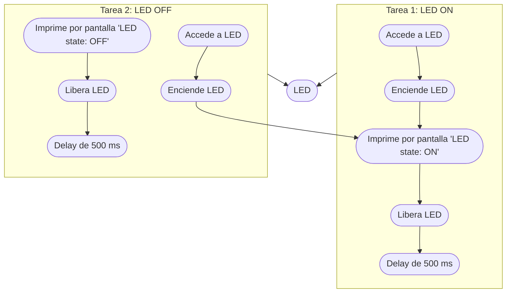

# Práctica 3. Gerard Cots y Joel J. Morera

## Introducción teórica

Pongamos por caso que tenemos un microcontrolador que lee un sensor de temperatura, lo muestra por una pantalla de tinta electrónica y lo envía a la nube. 

En caso que la pantalla de tinta electrónica tarde unos segundos en actualizarse, nos encontramos con que el resto de procesos venideros se ejecutan más tarde
debido a la demora de la pantalla. 

Si destinasemos un núcleo a imprimir el valor por pantalla y el resto se encargasen de los demás procesos no evitariamos la 
posible demora.

## Ejercicio práctico 1 

El funcionamento de este programa consiste en

EL **código** es el siguiente:

```cpp
#include <Arduino.h>

void setup()
{
    Serial.begin(112500);
    /* we create a new task here */
    xTaskCreate(
    anotherTask, /* Task function. */
    "another Task", /* name of task. */
    10000, /* Stack size of task */
    NULL, /* parameter of the task */
    1, /* priority of the task */
    NULL); /* Task handle to keep track of created task */
}

/* the forever loop() function is invoked by Arduino ESP32 loopTask */
void loop()
{
    Serial.println("this is ESP32 Task");
    delay(1000);
}

/* this function will be invoked when additionalTask was created */
void anotherTask( void * parameter )
{
    /* loop forever */
    for(;;)
    {
        Serial.println("this is another Task");
        delay(1000);
    }
    /* delete a task when finish,
    this will never happen because this is infinity loop */
    vTaskDelete( NULL );
}
```

El **diagrama de flujo** es:


## Ejercicio práctico 2

La función principal de este programa consiste en definir dos tareas, una que enciende un led y otra que lo apaga, ambas sincronizadas.

Con tal de que ambas tareas esten sincronizadas se hace uso de semaforos, en concreto de 'mutex'. Este tipo de semaforos permiten el acceso a un mismo recurso de manera segura, sin que se corrompa información, al querer acceder ambas tareas simultaneamente.

De manera resumida mientras una tarea este accediendo al recurso se manda una señal de espera a la otra tarea, denegando el acceso. Cuando la primera tarea termine se libera el recurso y permite a la otra tarea acceder a él. 

Por ulimo, cabe comentar que, además, se ha añadido un 'delay' de 500 ms entre encendido y apagado.

EL **código** es el siguiente:

```cpp
#include <Arduino.h>
#include <Arduino_FreeRTOS.h>
#include <semphr.h>

//Creation of semaphore
SemaphoreHandle_t mutex;

//Other variables
int LED = 23;

//Codigo que solo se ejecuta una vez
void setup()
{
	// Transmision rate
	Serial.begin(115200);

	//Set LED pin as OUTPUT
	pinMode(LED,OUTPUT);
	
	// Tasks creation
	xTaskCreateTaskSetLedON, "LED_ON", 10000, NULL, 0, NULL);
	xTaskCreateTaskSetLedOFF, "LED_OFF", 10000, NULL, 0, NULL);
	
	//Semaphore creation
	mutex = xSemaphoreCreateMutex();
	if(mutex == NULL)Serial.println("ERROR: Mutex cannot be created");
}

//Codigo que se ejeucta multiples veces
void loop() {}

//Code from the task that sets the LED on.
void TaskSetLedON (void *pvParameters)
{
	for(;;)
	{	
		xSemaphoreTake(mutex, portMAX_DELAY);
		digitalWrtie(LED, HIGH);
		Serial.println("LED state: ON");	
		xSemaphoreGive(mutex);
		vTaskDelay(pdMS_TO_TICKS(500));
	}
}

//Code from the task that sets the LED off.
void TaskSetLedOFF (void *pvParameters)
{
	for(;;)
	{		
		xSemaphoreTake(mutex, portMAX_DELAY);	
		digitalWrtie(LED, LOW);
		Serial.println("LED state: OFF");
		xSemaphoreGive(mutex);	
		vTaskDelay(pdMS_TO_TICKS(500));
	}
}
```

El **diagrama de flujo** es:


## Ejercicio práctico complementario

El siguiente programa realiza efectos visuales con 4 LEDS.

El **código** es el siguiente:
```cpp

```

El **diagrama de flujo** es: